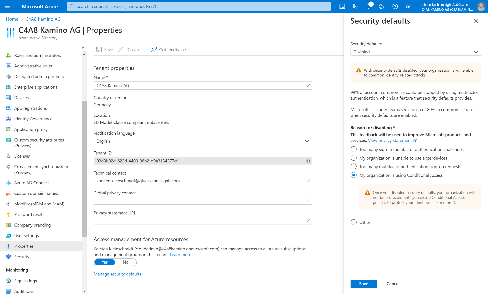

# Table of Contents

- [Table of Contents](#table-of-contents)
- [Overview](#overview)
  - [Prerequisites](#prerequisites)
    - [Installing Terraform](#installing-terraform)
  - [Example files and Terraform state](#example-files-and-terraform-state)
  - [Authenticating Terraform to Entra ID](#authenticating-terraform-to-entra-id)
    - [Use GitHub Actions with the included templates](#use-github-actions-with-the-included-templates)
- [Usage](#usage)
  - [Quick Setup](#quick-setup)
  - [Considerations and Preparation](#considerations-and-preparation)
    - [Break Glass Account](#break-glass-account)
    - [Conditional Access Policies](#conditional-access-policies)
  - [Working with Terraform templates](#working-with-terraform-templates)
    - [Terraform State](#terraform-state)
    - [Basic operations](#basic-operations)
    - [Modules](#modules)
  - [Importing existing resources](#importing-existing-resources)
- [Exporting a single existing Intune or Entra ID object to Terraform](#exporting-a-single-existing-intune-or-entra-id-object-to-terraform)
- [Importing / Managing an existing Tenant](#importing--managing-an-existing-tenant)
  - [Export Groups, Filters, Policies](#export-groups-filters-policies)
  - [Deploying](#deploying)
  - [Mapping and Importing](#mapping-and-importing)

# Overview

This project aims to provide a reference implementation of the [Terraform Provider for Microsoft 365](https://registry.terraform.io/providers/terraprovider/microsoft365wp) which is part of [TerraProvider](https://terraprovider.com).

## Prerequisites

For the Terraform templates you will need:

* A recent build of [Terraform](https://developer.hashicorp.com/terraform/downloads?product_intent=terraform) (tested with 1.7.5)
* An EntraID Tenant and an App Registration in this tenant. See [Authentication](#authentication) for details.


### Installing Terraform

Download the latest Terraform version from [here](https://www.terraform.io/downloads.html) and extract the binary to a folder in your PATH.

Alternatively (on Windows) use WinGet:
```powershell
winget install Hashicorp.Terraform
```

Feel free to use OpenTofu instead.

## Example files and Terraform state

Read `terraform.tf` and fill in the required values like tenant and Azure subscription. By default we assume to store the Terraform state in an Azure Storage Account in the same tenant.

I.e.: Configure the `backend` section in `terraform.tf` to use the Azure Storage Account.

## Authenticating Terraform to Entra ID

See the [Configuring a Service Principal for managing EntraID](https://registry.terraform.io/providers/terraprovider/microsoft365wp/latest/docs/guides/service-principal-configuration) for more details on how to authenticate against Entra ID.

Make sure the Service Principal has write permissions to the Terraform state. You can achieve this by assigning the "Storage Blob Data Contributor" role to the Service Principal.

We recommend using Federated Credentials via OpenID Connect. This way no credentials need to be stored.

For interactive and testing use, we recommend using a client ID and secret.

You can create a PowerShell script to load the needed environment variables, e.g.:
```powershell
$Env:ARM_CLIENT_ID = "{client_id}"
$Env:ARM_CLIENT_SECRET = "{client_secret}"
$Env:ARM_SUBSCRIPTION_ID = "{subscription_id}"
$Env:ARM_TENANT_ID = "{tenant_id}"
```

### Use GitHub Actions with the included templates

This template includes a GitHub Actions workflows to plan or plan and apply the Terraform templates.

See [.github/workflows/](./.github/workflows/) -  The workflows are configured to run only manually by default. Uncomment the "push" trigger to run on every push to the repository.

"workflow_dispatch" allows you to run the workflow manually from the GitHub Actions UI. Comment it out to disable manual runs.

```yaml
on:
  # push:
  #   branches:
  #   - main
  workflow_dispatch:
```

Be aware, by default our workflow use OpenTofu instead of TerraForm.

# Usage

## Quick Setup

1. Clone this repository.
2. fill/replace the placeholders in `terraform.tf` with your values
3. Read and modify the `terraform.tfvar` to match your needs.
4. Load the environment variables (see [Authenticating Terraform to Entra ID](#Authenticating-Terraform-to-Entra-ID))
5. Run `terraform init` to initialize the Terraform environment. This will also download the required Terraform providers incl. the Workplace provider.
6. Run `terraform apply` to create all resources.

## Considerations and Preparation

### Break Glass Account

The templates expect a "Break Glass Account" called `cloudadmin@{initialDomain}.onmicrosoft.com` to be present in the Entra ID Tenant. It will be excluded from critical conditional access policies and can be used to access the tenant in case of an emergency.

### Conditional Access Policies
The templates include Conditional Access Policies, so please make sure the the Entra ID security defaults are disabled. See [here](https://docs.microsoft.com/en-us/azure/active-directory/fundamentals/concept-fundamentals-security-defaults) for details.



Additionally, the "Admin 1" policy template is currently disabled by default to avoid locking yourself out.

## Working with Terraform templates

Terraform allows you to create, update and delete resources. It is intended to be used as a "single source of truth" for your infrastructure.

### Terraform State
Terraform will only update or delete resources that it feels responsible for. This is tracked in the Terraform state.

When you use templates to create resources these are automatically added to the state. It will never delete resources that are not in the state.

You can manually import existing resources to the state. See [Importing existing resources](#importing-existing-resources) for details. By this you can "adopt" existing resources into the state and manage them with Terraform.

The TerraForm state should either be included in the repository (when no other storage exists) or stored in a separate storage account when configuring a pipeline/GitHub Action.

### Basic operations

After running steps 1-3 from [Quick Setup](#quick-setup), you can use Terraform to manage resources.

The following commands are the most important ones:
- `terraform init` - Initializes the Terraform environment. This will also download the required Terraform providers incl. the Workplace provider.
- `terraform validate` - Validates the Terraform templates. This will check for syntax errors and missing variables.
- `terraform plan` - Shows the changes that Terraform will apply (as a "dry run"). It will not change any resources.
- `terraform apply` - Applies the changes to the resources. This will create, update or delete resources as required.
- `terraform destroy` - Destroys all resources that are managed by Terraform. This will not delete resources that are not in the state.

### Modules

The templates are separated into modules. Each module is contained in a single folder. Terraform will look for .tf files in a folder and apply them at the same time.

We tried to separate the templates by policy/object type. Each module will handly a specific type of resource and in most cases where there are multiple resources, the definition of resources is found in a file prefixed by `def.`. The other files are scaffolding and configuration.

Each module can be activated or deactivated by a variable prefixed by `manage_` in `terraform.tfvars`.

## Importing existing resources

You can import existing AzureAD groups and policies into the Terraform state using the `terraform import` command.

Assume you already have a group called "All AutoPilot Devices" and want to match it to the `all_autopilot_device` resource in the `groups` module.

```terraform
resource "azuread_group" "all_autopilot_device" {
  display_name     = "All Autopilot Devices"
  mail_enabled     = false
  security_enabled = true
  types = [
    "DynamicMembership"
  ]
  ...
```

You can import the group into the state using the following command, of course replacing `<object_id>` with the actual object id of the group:

```powershell
terraform import module.groups.azuread_group.all_autopilot_device <object_id>
```

The next time you run `terraform plan` or `terraform apply` Terraform will recognize the group and will not try to create it again.

Be aware - running `terraform destroy` or removing the template will delete the group from AzureAD.

# Exporting a single existing Intune or Entra ID object to Terraform

We include [a script](./tools/aad2tf/ReadMe.md) to create a Terraform template from an existing Entra ID or Intune object. This script will create a .tf file if given the correct type and object id. You can use this to export existing objects or understand how to write a new object.

Example to export a device configuration policy:
```powershell
. ./aad2tf.ps1 "microsoft365wp_device_management_configuration_policy" "ce9b10b1-ca89-4e30-912d-595d2093f63a"
```

Make sure to load the environment variables (for authentication) before running the script.

# Importing / Managing an existing Tenant 

Similiar to the script mentioned above, we offer a PowerShell module that allows to export objects from 

EntraID
- Groups

Intune
- Filters
- Notification Templates (Compliance)
- Compliance Policies
- Settings Catalog Policies ("Configuration Policies")

directly into the appropriate files here in the repository, so that they are available as map and can be controlled e.g. via `configuration_policy_customization` or `compliance_policy_customization` variables.

to use it, import it 
```powershell
. ./tools/export/wf-export-library.ps1
```

Requirements:
- An existing connection with `Connect-MgGraph` to the tenant
- `ARM_CLIENT_ID`, `ARM_CLIENT_SECRET`, `ARM_TENANT_ID`, `ARM_SUBSCRIPTION_ID` set in the environment

The appropriate permissions are required to export the objects.

The exports have to be done in a certain order, to allow the dependencies to be resolved.

## Export Groups, Filters, Policies

go to the root folder of the Quickstart repository and run the following commands:

```powershell
Export-EntraIDGroups -overwrite
Export-IntuneFilters -overwrite
Export-IntuneNotificationMessageTemplates -overwrite
Export-IntuneCompliancePolicies -overwrite
Export-IntuneConfigurationPolicies -overwrite
```

This will overwrite existing files in each module, like `configuration-policies/def.exported.tf` or `compliance-policies/def.exported.tf`. 

Additionally it will create a JSON mappings `*.mappings.json` for each object typ in the root folder. These are used to 
- resolve dependencies between objects
- map the objects when importing an existing tenant

If desired, this can serve as a backup for you policies. By default each export also create a raw dump of the JSON objects from MS Graph which might help in case of issues.

## Deploying 

After the exports are done, you can use Terraform/Tofu to deploy the objects to the tenant. 

```powershell
tofu init
tofu plan
tofu apply
```

## Mapping and Importing

If you want to take an existing tenant into management, you can use the mappings to import the objects a Terraform state.

Make sure to have the environment variables set and the connection to the tenant established. Also make sure to have the mappings in the root folder and the exported files in place.

The module offers CMDlets to call Terraform/Tofu to import the objects.

```powershell
tofu init
Import-EntraIDGroups
Import-IntuneFilters
Import-IntuneNotificationMessageTemplates
Import-IntuneCompliancePolicies
Import-IntuneConfigurationPolicies
``` 

